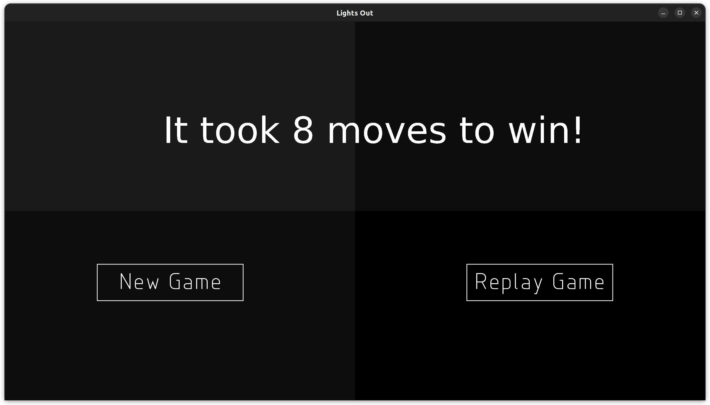

# LightsOut
This is an implementation of the classic lights out game.  
Below is what the game looks like.  
### Starting the game

### Entering your name

### Game play

### Hint to solve the game

### Resetting the game to a new board

### After solving the game

### Display of current rankings with number of moves used

